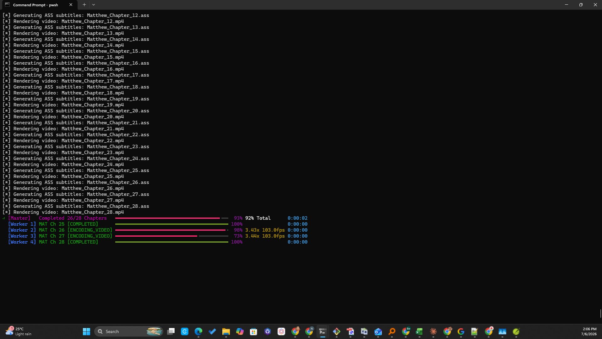

# Sample Terminal Output — Reference for Documentation

Raw CLI output captured from real runs during development, kept verbatim so it can be
reused/quoted when writing user-facing docs (README, getting_started.md, user_guide.md).

## Live multi-worker progress UI (screenshot)



A 4-worker GPU batch render of Matthew (28 chapters) approaching completion — shows the
`[Master]` overall progress bar alongside each `[Worker N]` bar with live speed/fps/ETA,
the same "Live Batch Monitor" UI documented in `docs/user_guide.md`'s multi-worker section.

## `vidx.exe -c john.yaml --gpu -y` (single worker, 21 chapters)

Command:
```
dist\vidx.exe -c "src\snd\sindhi-audio-bible-artifacts\Audio bible\JOHN\john.yaml" --gpu -y
```

Output:
```
requests\__init__.py:92: RequestsDependencyWarning: Unable to find acceptable character detection dependency (chardet or charset_normalizer).
╭───────────────────────────────────────────────── ⚡ LIVE BATCH MONITOR ⚡ ──────────────────────────────────────────────────╮
│ VIDX Scripture Video Batch Processing Engine                                                                                │
│ Total Chapters in Queue: 21 | Columns: Worker • Book/Ch [Status] • Progress • Speed/FPS • ETA                               │
╰─────────────────────────────────────────────────────────────────────────────────────────────────────────────────────────────╯
=== Starting Batch Run (21 jobs, 1 workers) ===
[*] Generating ASS subtitles: John_Chapter_01.ass
[*] Rendering video: John_Chapter_01.mp4
[*] Generating ASS subtitles: John_Chapter_02.ass
[*] Rendering video: John_Chapter_02.mp4
[*] Generating ASS subtitles: John_Chapter_03.ass
[*] Rendering video: John_Chapter_03.mp4
[*] Generating ASS subtitles: John_Chapter_04.ass
[*] Rendering video: John_Chapter_04.mp4
[*] Generating ASS subtitles: John_Chapter_05.ass
[*] Rendering video: John_Chapter_05.mp4
[*] Generating ASS subtitles: John_Chapter_06.ass
[*] Rendering video: John_Chapter_06.mp4
[*] Generating ASS subtitles: John_Chapter_07.ass
[*] Rendering video: John_Chapter_07.mp4
[*] Generating ASS subtitles: John_Chapter_08.ass
[*] Rendering video: John_Chapter_08.mp4
[*] Generating ASS subtitles: John_Chapter_09.ass
[*] Rendering video: John_Chapter_09.mp4
[*] Generating ASS subtitles: John_Chapter_10.ass
[*] Rendering video: John_Chapter_10.mp4
[*] Generating ASS subtitles: John_Chapter_11.ass
[*] Rendering video: John_Chapter_11.mp4
[*] Generating ASS subtitles: John_Chapter_12.ass
[*] Rendering video: John_Chapter_12.mp4
[*] Generating ASS subtitles: John_Chapter_13.ass
[*] Rendering video: John_Chapter_13.mp4
[*] Generating ASS subtitles: John_Chapter_14.ass
[*] Rendering video: John_Chapter_14.mp4
[*] Generating ASS subtitles: John_Chapter_15.ass
[*] Rendering video: John_Chapter_15.mp4
[*] Generating ASS subtitles: John_Chapter_16.ass
[*] Rendering video: John_Chapter_16.mp4
[*] Generating ASS subtitles: John_Chapter_17.ass
[*] Rendering video: John_Chapter_17.mp4
[*] Generating ASS subtitles: John_Chapter_18.ass
[*] Rendering video: John_Chapter_18.mp4
[*] Generating ASS subtitles: John_Chapter_19.ass
[*] Rendering video: John_Chapter_19.mp4
[*] Generating ASS subtitles: John_Chapter_20.ass
[*] Rendering video: John_Chapter_20.mp4
[*] Generating ASS subtitles: John_Chapter_21.ass
[*] Rendering video: John_Chapter_21.mp4

  [Master]   Completed 21/21 Chapters ━━━━━━━━━━━━━━━━━━━━━━━━━━━━━━━━━━━━━━━━ 100% 100% Total 0:00:00
  [Worker 1] JHN Ch 21 [COMPLETED]    ━━━━━━━━━━━━━━━━━━━━━━━━━━━━━━━━━━━━━━━━ 100%            0:00:00                                📊 Scripture Conversion Batch Summary
┏━━━━━━┳━━━━━━━━┳━━━━━━━┳━━━━━━━━━━━━━━━━━━━━━┳━━━━━━━━━━━━┳━━━━━━━━━━━━━━━━┳━━━━━━━━━━━━━━┳━━━━━━━━━┓
┃  #   ┃  Book  ┃  Ch   ┃ Output File         ┃   Duration ┃    Encoder     ┃    Status    ┃ Details ┃
┡━━━━━━╇━━━━━━━━╇━━━━━━━╇━━━━━━━━━━━━━━━━━━━━━╇━━━━━━━━━━━━╇━━━━━━━━━━━━━━━━╇━━━━━━━━━━━━━━╇━━━━━━━━━┩
│  1   │  JHN   │  01   │ John_Chapter_01.mp4 │     55.04s │   h264_nvenc   │  ✔ SUCCESS   │ -       │
│      │        │       │                     │            │     (GPU)      │              │         │
├──────┼────────┼───────┼─────────────────────┼────────────┼────────────────┼──────────────┼─────────┤
│  2   │  JHN   │  02   │ John_Chapter_02.mp4 │     34.01s │   h264_nvenc   │  ✔ SUCCESS   │ -       │
│      │        │       │                     │            │     (GPU)      │              │         │
├──────┼────────┼───────┼─────────────────────┼────────────┼────────────────┼──────────────┼─────────┤
│  3   │  JHN   │  03   │ John_Chapter_03.mp4 │     48.74s │   h264_nvenc   │  ✔ SUCCESS   │ -       │
│      │        │       │                     │            │     (GPU)      │              │         │
├──────┼────────┼───────┼─────────────────────┼────────────┼────────────────┼──────────────┼─────────┤
│  4   │  JHN   │  04   │ John_Chapter_04.mp4 │     57.13s │   h264_nvenc   │  ✔ SUCCESS   │ -       │
│      │        │       │                     │            │     (GPU)      │              │         │
├──────┼────────┼───────┼─────────────────────┼────────────┼────────────────┼──────────────┼─────────┤
│  5   │  JHN   │  05   │ John_Chapter_05.mp4 │     51.11s │   h264_nvenc   │  ✔ SUCCESS   │ -       │
│      │        │       │                     │            │     (GPU)      │              │         │
├──────┼────────┼───────┼─────────────────────┼────────────┼────────────────┼──────────────┼─────────┤
│  6   │  JHN   │  06   │ John_Chapter_06.mp4 │    1m 7.1s │   h264_nvenc   │  ✔ SUCCESS   │ -       │
│      │        │       │                     │            │     (GPU)      │              │         │
├──────┼────────┼───────┼─────────────────────┼────────────┼────────────────┼──────────────┼─────────┤
│  7   │  JHN   │  07   │ John_Chapter_07.mp4 │     55.40s │   h264_nvenc   │  ✔ SUCCESS   │ -       │
│      │        │       │                     │            │     (GPU)      │              │         │
├──────┼────────┼───────┼─────────────────────┼────────────┼────────────────┼──────────────┼─────────┤
│  8   │  JHN   │  08   │ John_Chapter_08.mp4 │     58.49s │   h264_nvenc   │  ✔ SUCCESS   │ -       │
│      │        │       │                     │            │     (GPU)      │              │         │
├──────┼────────┼───────┼─────────────────────┼────────────┼────────────────┼──────────────┼─────────┤
│  9   │  JHN   │  09   │ John_Chapter_09.mp4 │     45.89s │   h264_nvenc   │  ✔ SUCCESS   │ -       │
│      │        │       │                     │            │     (GPU)      │              │         │
├──────┼────────┼───────┼─────────────────────┼────────────┼────────────────┼──────────────┼─────────┤
│  10  │  JHN   │  10   │ John_Chapter_10.mp4 │     51.00s │   h264_nvenc   │  ✔ SUCCESS   │ -       │
│      │        │       │                     │            │     (GPU)      │              │         │
├──────┼────────┼───────┼─────────────────────┼────────────┼────────────────┼──────────────┼─────────┤
│  11  │  JHN   │  11   │ John_Chapter_11.mp4 │    1m 3.9s │   h264_nvenc   │  ✔ SUCCESS   │ -       │
│      │        │       │                     │            │     (GPU)      │              │         │
├──────┼────────┼───────┼─────────────────────┼────────────┼────────────────┼──────────────┼─────────┤
│  12  │  JHN   │  12   │ John_Chapter_12.mp4 │   1m 10.0s │   h264_nvenc   │  ✔ SUCCESS   │ -       │
│      │        │       │                     │            │     (GPU)      │              │         │
├──────┼────────┼───────┼─────────────────────┼────────────┼────────────────┼──────────────┼─────────┤
│  13  │  JHN   │  13   │ John_Chapter_13.mp4 │     47.20s │   h264_nvenc   │  ✔ SUCCESS   │ -       │
│      │        │       │                     │            │     (GPU)      │              │         │
├──────┼────────┼───────┼─────────────────────┼────────────┼────────────────┼──────────────┼─────────┤
│  14  │  JHN   │  14   │ John_Chapter_14.mp4 │     43.99s │   h264_nvenc   │  ✔ SUCCESS   │ -       │
│      │        │       │                     │            │     (GPU)      │              │         │
├──────┼────────┼───────┼─────────────────────┼────────────┼────────────────┼──────────────┼─────────┤
│  15  │  JHN   │  15   │ John_Chapter_15.mp4 │     40.45s │   h264_nvenc   │  ✔ SUCCESS   │ -       │
│      │        │       │                     │            │     (GPU)      │              │         │
├──────┼────────┼───────┼─────────────────────┼────────────┼────────────────┼──────────────┼─────────┤
│  16  │  JHN   │  16   │ John_Chapter_16.mp4 │     47.50s │   h264_nvenc   │  ✔ SUCCESS   │ -       │
│      │        │       │                     │            │     (GPU)      │              │         │
├──────┼────────┼───────┼─────────────────────┼────────────┼────────────────┼──────────────┼─────────┤
│  17  │  JHN   │  17   │ John_Chapter_17.mp4 │     34.25s │   h264_nvenc   │  ✔ SUCCESS   │ -       │
│      │        │       │                     │            │     (GPU)      │              │         │
├──────┼────────┼───────┼─────────────────────┼────────────┼────────────────┼──────────────┼─────────┤
│  18  │  JHN   │  18   │ John_Chapter_18.mp4 │     58.27s │   h264_nvenc   │  ✔ SUCCESS   │ -       │
│      │        │       │                     │            │     (GPU)      │              │         │
├──────┼────────┼───────┼─────────────────────┼────────────┼────────────────┼──────────────┼─────────┤
│  19  │  JHN   │  19   │ John_Chapter_19.mp4 │    1m 1.2s │   h264_nvenc   │  ✔ SUCCESS   │ -       │
│      │        │       │                     │            │     (GPU)      │              │         │
├──────┼────────┼───────┼─────────────────────┼────────────┼────────────────┼──────────────┼─────────┤
│  20  │  JHN   │  20   │ John_Chapter_20.mp4 │     39.94s │   h264_nvenc   │  ✔ SUCCESS   │ -       │
│      │        │       │                     │            │     (GPU)      │              │         │
├──────┼────────┼───────┼─────────────────────┼────────────┼────────────────┼──────────────┼─────────┤
│  21  │  JHN   │  21   │ John_Chapter_21.mp4 │     35.90s │   h264_nvenc   │  ✔ SUCCESS   │ -       │
│      │        │       │                     │            │     (GPU)      │              │         │
└──────┴────────┴───────┴─────────────────────┴────────────┴────────────────┴──────────────┴─────────┘
                              📈 Per-Book Execution Summary
┏━━━━━━┳━━━━━━━━━━┳━━━━━━━━━━━┳━━━━━━━━┳━━━━━━━━━━━━━━━━┳━━━━━━━━━━━━━━━━┳━━━━━━━━━━━━━━━┓
┃ Book ┃ Chapters ┃ Succeeded ┃ Failed ┃ Total GPU Time ┃ Total CPU Time ┃ Avg Time / Ch ┃
┡━━━━━━╇━━━━━━━━━━╇━━━━━━━━━━━╇━━━━━━━━╇━━━━━━━━━━━━━━━━╇━━━━━━━━━━━━━━━━╇━━━━━━━━━━━━━━━┩
│ JHN  │    21    │    21     │   0    │      17m 46.6s │              - │        50.79s │
└──────┴──────────┴───────────┴────────┴────────────────┴────────────────┴───────────────┘
╭────────────────── 🏁 FINAL RESULTS 🏁 ──────────────────╮
│ Total Elapsed: 17m 46.6s  |  GPU Render Time: 17m 46.6s │
│ Succeeded: 21  |  Failed: 0                             │

[+] YouTube Outbox Manifest updated: output\john_sindhi\publish_manifest.json (21 items)
  [Master]   Completed 21/21 Chapters ━━━━━━━━━━━━━━━━━━━━━━━━━━━━━━━━━━━━━━━━ 100% 100% Total 0:00:00
  [Worker 1] JHN Ch 21 [COMPLETED]    ━━━━━━━━━━━━━━━━━━━━━━━━━━━━━━━━━━━━━━━━ 100%            0:00:00
```

**Context:** this is the `-w 1` (single worker) counterpart used to benchmark against the earlier
`-w 4` production run of the same book (see `docs/todo.md`'s "GPU Worker Count Right-Sizing" item,
tracked as [issue #5](https://github.com/beniza/vidx/issues/5)) — 50.79s/chapter average vs. 125.37s/chapter
under 4-worker contention, with this run's `17m 46.6s` being the true measured wall-clock baseline.
