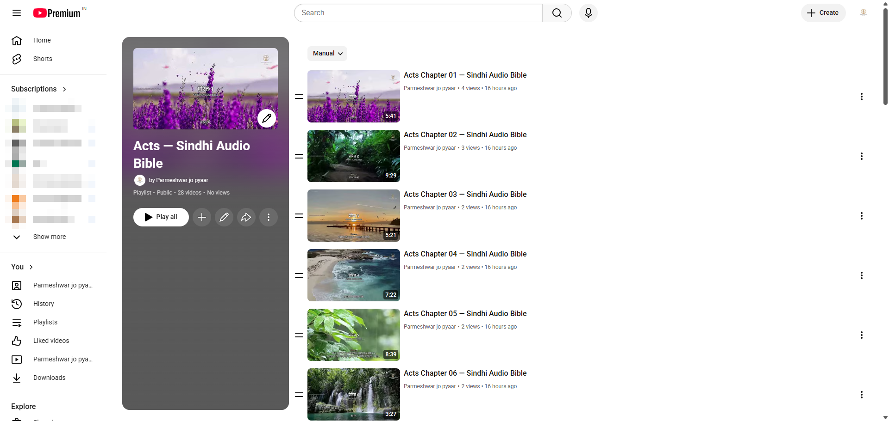

<div style="page-break-after: always; break-after: page; min-height: 92vh; margin: -1in -1in 0 -1in; padding: 1in; background: linear-gradient(160deg, #0b1d3a 0%, #1a1042 55%, #2a0e3d 100%); display: flex; flex-direction: column; align-items: center; justify-content: center; color: #ffffff; font-family: Helvetica, Arial, sans-serif; box-sizing: border-box; text-align: center;">
  <svg width="300" height="240" viewBox="0 0 400 300">
    <polygon points="60,230 200,190 200,90 60,130" fill="#ece6d6" opacity="0.96"/>
    <polygon points="340,230 200,190 200,90 340,130" fill="#f7f3e7" opacity="0.96"/>
    <line x1="80" y1="150" x2="180" y2="122" stroke="#a39a86" stroke-width="2"/>
    <line x1="80" y1="170" x2="180" y2="145" stroke="#a39a86" stroke-width="2"/>
    <line x1="80" y1="190" x2="180" y2="168" stroke="#a39a86" stroke-width="2"/>
    <line x1="80" y1="210" x2="180" y2="191" stroke="#a39a86" stroke-width="2"/>
    <line x1="220" y1="122" x2="320" y2="150" stroke="#a39a86" stroke-width="2"/>
    <line x1="220" y1="145" x2="320" y2="170" stroke="#a39a86" stroke-width="2"/>
    <line x1="220" y1="168" x2="320" y2="190" stroke="#a39a86" stroke-width="2"/>
    <line x1="220" y1="191" x2="320" y2="210" stroke="#a39a86" stroke-width="2"/>
    <line x1="200" y1="90" x2="200" y2="190" stroke="#5a5040" stroke-width="3"/>
    <circle cx="200" cy="150" r="48" fill="#f2b134" opacity="0.16"/>
    <circle cx="200" cy="150" r="34" fill="#f2b134"/>
    <polygon points="190,132 190,168 216,150" fill="#1a1042"/>
    <rect x="118" y="245" width="9" height="18" rx="2" fill="#f2b134"/>
    <rect x="137" y="233" width="9" height="30" rx="2" fill="#f2b134"/>
    <rect x="156" y="218" width="9" height="45" rx="2" fill="#f2b134"/>
    <rect x="175" y="238" width="9" height="25" rx="2" fill="#f2b134"/>
    <rect x="194" y="226" width="9" height="37" rx="2" fill="#f2b134"/>
    <rect x="213" y="236" width="9" height="27" rx="2" fill="#f2b134"/>
    <rect x="232" y="220" width="9" height="43" rx="2" fill="#f2b134"/>
    <rect x="251" y="238" width="9" height="25" rx="2" fill="#f2b134"/>
    <rect x="270" y="247" width="9" height="16" rx="2" fill="#f2b134"/>
  </svg>
  <div style="font-size: 54px; font-weight: 700; letter-spacing: 6px; margin-top: 8px;">VIDX</div>
  <div style="font-size: 21px; color: #f2b134; font-weight: 600; margin-top: 10px;">Turn Your Scripture App Into Videos</div>
  <div style="font-size: 13px; color: #beb8d6; letter-spacing: 1px; margin-top: 30px;">A short explainer for translation and literacy teams</div>
</div>

# VIDX — Turn Your Scripture App Into Videos

## 💡 What VIDX does

VIDX turns your Scripture App's own files into a finished, subtitle-synced video
ready to share on YouTube.

> **You already did the hard part.** If your team has built a Scripture App for
> your language, you've already done the hardest work there is: lining up the
> scripture text, word by word, with the recorded narration audio. VIDX doesn't
> redo any of that — it reuses it. Nothing gets re-recorded. Nothing gets
> re-aligned. Your team is one step away from a video you didn't know you could
> already make.

---

## 🙋 Who this is for

VIDX is for teams who have **already built a Scripture App using Scripture App
Builder**. If that's your team, VIDX is ready and waiting for you.

If your team hasn't built a Scripture App yet, that's a different step, owned by
the **software department** — reach out to them directly to get one started.
Once your app exists, come back to VIDX any time.

---

## 📂 What you already have

Three things came out of building your Scripture App, and VIDX reuses all three
exactly as they are — no new recording, no new alignment work, no new files to
prepare:

| | File | What it is |
|---|---|---|
| 📖 | **Scripture text** | The translated words themselves |
| 🎙️ | **Narration audio** | The recorded voice reading those words aloud |
| ⏱️ | **Timing file** | Created by Scripture App Builder — marks exactly when each verse or phrase is spoken |

---

## 🎬 What you get

A finished video with your background of choice playing behind the narration,
scripture text appearing on screen in sync with the voice, in your own language
and script — and, if you'd like, your ministry's logo watermark and background
music underneath. Complex scripts are fully supported and already in real,
day-to-day use — languages using Devanagari, Malayalam, Thai, and Arabic-derived
scripts have already had full books produced this way.


*VIDX generating a batch of chapters. Each row tracks one chapter's progress as it renders.*


*A real, public YouTube playlist — every chapter generated by VIDX and published as its own video, each with its own thumbnail and title.*

---

## ⚙️ How it works, simply

1. **Bring your files** — the scripture text, audio, and timing file from your
   Scripture App project.
2. **VIDX builds the video** — automatically, chapter by chapter.
3. **You publish to YouTube** — either by hand, or with VIDX's help.

That's the whole process. No video editing software, no manual subtitle work.

**A note on speed:** how fast step 2 happens depends on the computer doing
the work. On a computer with a supported graphics card, VIDX can use it to
build videos several times faster. Without one, VIDX still works exactly
the same way — it just renders each chapter on the computer's processor
instead, which takes noticeably longer per chapter. Either way produces the
same finished video; a graphics card only changes how long the wait is.

---

## 🛠️ What it takes to get set up

There's a one-time technical setup involved — getting VIDX installed and
configured on a Windows computer. This isn't something your team needs to
figure out alone: **a Media Fellowship Team** walks teams through this setup,
start to finish.

Once it's set up, generating videos going forward is simple and repeatable.

---

## 🚧 What's next for VIDX

VIDX is actively being improved. A few things currently in progress:

- Making batch video generation smarter about picking up where it left off,
  instead of starting over.
- Making the YouTube upload process more reliable across multiple days of
  publishing.
- Automatically generating chapter markers and verse timestamps for YouTube,
  so viewers can jump straight to the part they want.
- General reliability polish across the tool.

These are in progress, not promises with a date attached — but they show VIDX
is actively maintained and getting better.

---

## ✅ How to start

If this sounds like something your team wants, **register your interest on
this session's form.** That's all that's needed for now — you're only letting
us know you'd like to explore this, nothing more.

Sending your actual project files is a separate, later step, handled through
the proper channels once your interest is registered.

If your team wants help getting started, training and setup support are
available — just let us know on the form.

---

## 📊 Appendix: A Real Run, Unedited Numbers

Everything above is described in plain terms. This page is the opposite — the
literal, unedited output from one real VIDX run, included so the results above
can be checked rather than taken on faith. This is the Gospel of John, 21
chapters, rendered end to end on a single pass, **using a GPU**. Rendering the
same chapters on a computer without a supported graphics card would take
noticeably longer per chapter — VIDX's own documentation puts GPU rendering
at roughly 3-10x faster than processor-only rendering, though that exact
multiplier varies by computer, and no side-by-side CPU-only timing for this
specific book has been measured.

| Chapter | Render Time | Result |
|---|---|---|
| 1  | 0:55.04 | ✅ Success |
| 2  | 0:34.01 | ✅ Success |
| 3  | 0:48.74 | ✅ Success |
| 4  | 0:57.13 | ✅ Success |
| 5  | 0:51.11 | ✅ Success |
| 6  | 1:07.10 | ✅ Success |
| 7  | 0:55.40 | ✅ Success |
| 8  | 0:58.49 | ✅ Success |
| 9  | 0:45.89 | ✅ Success |
| 10 | 0:51.00 | ✅ Success |
| 11 | 1:03.90 | ✅ Success |
| 12 | 1:10.00 | ✅ Success |
| 13 | 0:47.20 | ✅ Success |
| 14 | 0:43.99 | ✅ Success |
| 15 | 0:40.45 | ✅ Success |
| 16 | 0:47.50 | ✅ Success |
| 17 | 0:34.25 | ✅ Success |
| 18 | 0:58.27 | ✅ Success |
| 19 | 1:01.20 | ✅ Success |
| 20 | 0:39.94 | ✅ Success |
| 21 | 0:35.90 | ✅ Success |

**Totals from this run:** 21 of 21 chapters succeeded, 0 failed. Total time
17:46.6, averaging 0:50.79 per chapter. Every chapter listed above rendered
successfully — nothing here has been rounded up, cherry-picked, or cleaned
up beyond formatting the same numbers into a table.

---

## 💻 Appendix: Installing VIDX (and FFmpeg)

This page is for whoever is doing the one-time technical setup — normally
walked through directly by the Media Fellowship Team, included here for
reference.

### Step 1 — Get VIDX

Download the program directly:

**[⬇ Download vidx.exe](https://github.com/beniza/vidx/releases/download/v0.3.4/vidx.exe)**

This is a self-contained Windows program — no Python installation required
to run it. Your project coordinator will also provide your project folder
(scripture text, audio, timing files, and configuration).

### Step 2 — Install FFmpeg (read this one carefully)

> ⚠️ **This is the single most common setup failure.** VIDX relies on FFmpeg
> to actually build the video, but does not include it inside `vidx.exe` —
> it's a real, separate install. Skipping this step, or forgetting to add
> FFmpeg to your PATH, is the #1 reason a first run fails.

Install FFmpeg **version 4.3 or newer** using whichever of these your
computer already has available — pick one:

| If you have... | Run this in PowerShell |
|---|---|
| **Winget** (built into Windows 10/11) | `winget install -e --id Gyan.FFmpeg` |
| **Chocolatey** | `choco install ffmpeg` |
| **Scoop** | `irm get.scoop.sh \| iex` *(one-time, installs Scoop itself)*, then `scoop install ffmpeg` |

No package manager? Download it manually from the official page:
**[ffmpeg.org/download.html](https://ffmpeg.org/download.html)** → under
Windows, choose the **gyan.dev** builds → download the **"essentials"**
build (`ffmpeg-release-essentials.zip`) → extract it anywhere on your
computer (e.g. `C:\ffmpeg`).

### Step 3 — Add FFmpeg to your PATH (do not skip this)

If you installed with winget, Chocolatey, or Scoop, this is usually done
for you automatically. If you downloaded manually, Windows still needs to
be told where to find it:

1. Open the Start Menu, type **"environment variables"**, and open
   **"Edit the system environment variables."**
2. Click the **Environment Variables...** button.
3. Under **"User variables,"** select **Path**, then click **Edit...**.
4. Click **New**, and paste the path to FFmpeg's `bin` folder — for
   example, `C:\ffmpeg\ffmpeg-release-essentials\bin` (the exact folder
   name depends on the version you downloaded).
5. Click **OK** on every window to save.

### Step 4 — Verify it actually worked

**Open a brand-new terminal window** (PATH changes don't apply to terminals
that were already open) and type:
```
ffmpeg -version
```
You should see version details printed immediately. If you instead see
something like `'ffmpeg' is not recognized as an internal or external
command`, FFmpeg is not correctly on your PATH — go back to Step 3.

### Step 5 — Install your fonts

Whatever font your project's configuration specifies (e.g. `Nirmala UI`,
`Mangal`, `Bailey`) must already be installed on that same Windows computer
— otherwise scripture text renders as blank boxes instead of real
characters.

That's the entire one-time setup.

---

## 🚦 Appendix: Getting Started (First Run)

1. Open your project folder in Windows File Explorer, click the address
   bar, type `powershell` (or `cmd`), and press **Enter** — this opens a
   terminal already inside your project folder.
2. *(Optional)* Open your project's `.yaml` configuration file in Notepad
   to review fonts, colors, or background settings. Everything is
   normally already set up for you by your coordinator.
3. Run your video generator:
   ```
   .\dist\vidx.exe -c your_project.yaml
   ```
4. Watch the live progress display while VIDX renders each chapter. When
   it finishes, your videos are waiting in the `output` folder, ready to
   view or publish.

---

## 📋 Appendix: Command Reference

VIDX is controlled with one program and a set of flags added after it. This
is every flag `vidx.exe` currently understands, in plain terms, for anyone
who wants to go beyond the default command.

**Telling VIDX what to work on**

| Flag | What it does |
|---|---|
| `-c`, `--config` | Path to a `.yaml` project configuration file — the normal way to run a full batch of chapters. |
| `--usfm` | Path to a single scripture text file (used instead of `-c` for a one-off, single-chapter run). |
| `--timing` | Path to that chapter's timing file. |
| `--audio` | Path to that chapter's narration audio file. |
| `-o`, `--output` | Where to save the finished video file. |
| `-b`, `--bg` | Path to a background video or image file. |

**Controlling how it renders**

| Flag | What it does |
|---|---|
| `-t`, `--duration` | Only render the first N seconds — useful for quickly previewing a style change without waiting for a full chapter. |
| `-w`, `--workers` | How many chapters to render at the same time (e.g. `-w 4`). Speeds up large batches. |
| `--gpu` | Turns on GPU hardware acceleration, if the computer has a supported graphics card. |
| `--codec` | Manually choose a specific video codec instead of letting VIDX pick automatically. |
| `--res`, `--resolution` | Override the output video's resolution (e.g. `1080x1920` for a vertical video). |
| `-y`, `--yes` | Automatically confirm any one-time prompts (like downscaling an oversized background video) instead of waiting for a keypress. |

**Subtitle-only mode** (no video rendering at all)

| Flag | What it does |
|---|---|
| `--generate-only` | Produce only subtitle files, skipping video rendering entirely. |
| `--format` | Which subtitle format to produce: `ass`, `srt`, or `both`. |
| `--keep-ass` / `--clean-ass` | Keep or delete the intermediate subtitle file VIDX creates while rendering. |

**Publishing to YouTube**

| Flag | What it does |
|---|---|
| `--publish` | After rendering, upload the finished videos to YouTube. |
| `--manifest` | Publish from a previously saved upload list, without re-rendering anything — this is also how an interrupted upload resumes the next day. |

**General**

| Flag | What it does |
|---|---|
| `-h`, `--help` | Show this same list from the command line. |
| `-v`, `--version` | Show which version of VIDX is installed. |

---

## 🔧 Appendix: Configuration File Reference

Every VIDX project has a `.yaml` "recipe" file controlling everything about
how the video looks and behaves. This appendix documents every key it
understands, followed by ready-to-copy sample configs. Most of these are
already set up correctly by whoever prepared your project — this is for
anyone who wants to understand or adjust the recipe file directly.

A config file has up to six top-level sections: `project`, `video`, `audio`,
`style`, `jobs`, and (for automated YouTube publishing) `publishing`.

### `project` — project metadata

| Key | What it does | Example |
|---|---|---|
| `name` | Descriptive title, used in logs. | `"Gospel of Mark Release"` |
| `output_dir` | Folder where finished videos/subtitles are written. | `"output/mark"` |
| `generate_only` | If `true`, skips video rendering and only produces subtitle files. | `false` |
| `subtitle_format` | Which subtitle format(s) to produce when generating subtitles. | `"ass"`, `"srt"`, or `"both"` |

### `video` — the canvas and background

| Key | What it does | Example |
|---|---|---|
| `resolution` | Output video dimensions. `1920x1080` widescreen, `1080x1920` vertical/Shorts, `1080x1080` square. | `"1920x1080"` |
| `fps` | Frames per second. | `24` |
| `codec` | Video encoder. | `"libx264"` (software) |
| `preset` | Encoding speed vs. compression tradeoff. | `"fast"` |
| `crf` | Quality level, lower = higher quality (0-51). | `23` |
| `background_media` | Path to the background video or image. | `"src/backgrounds/loop.mp4"` |
| `loop_background` | Repeats a short background clip to match audio length. | `true` |
| `scaling_mode` | How the background fits the canvas: `pad` (letterbox), `crop` (fill), or `stretch`. | `"crop"` |
| `gpu` | Turns on GPU hardware encoding (same as CLI `--gpu`). | `true` |
| `loop_crossfade_sec` | Smooths the seam when a background loop repeats. | `1.0` |
| `watermark` | Corner logo overlay — see sub-keys below. | *(see below)* |
| `title_card` | A still image shown before scripture narration starts. | `"assets/title.jpg"` |
| `title_duration` | How many seconds the title card displays. | `4.0` |

**`video.watermark` sub-keys:** `image` (path to a transparent PNG),
`position` (`top-left`/`top-right`/`bottom-left`/`bottom-right`), `margin`
(distance from the edge, in pixels), `scale` (size as a fraction of video
width, e.g. `0.15` = 15%), `opacity` (`0.0`-`1.0`).

### `audio` — narration, bumpers, and background music

| Key | What it does | Example |
|---|---|---|
| `codec` | Audio encoder. | `"aac"` |
| `bitrate` | Audio quality. | `"192k"` |
| `sample_rate` | Audio sample rate in Hz. | `48000` |
| `intro_clip` | An audio clip played before the narration starts. | `"assets/intro.mp3"` |
| `outro_clip` | An audio clip played after the narration ends. | `"assets/outro.mp3"` |
| `background_music` | A music track looped quietly under the narration. | `"assets/bgm.mp3"` |
| `background_music_volume` | Music volume, `0.0` to `1.0`. | `0.15` |
| `fade_in_sec` / `fade_out_sec` | Smooth audio fade at the start/end. | `1.5` |

### `style` — fonts, colors, and positioning

Three sub-sections control on-screen text: `style.verse` (the scripture
text itself), `style.heading` (section headings), and `style.verse_number`
(the small "1:1" reference marks).

| Key | What it does | Example |
|---|---|---|
| `font` | Font name — must be installed on the rendering computer. | `"Nirmala UI"` |
| `size` | Font size in points. | `48` |
| `color` | Text color, as a hex code. | `"#FFFFFF"` |
| `outline_color` / `outline_width` | Text border color and thickness. | `"#000000"`, `3` |
| `shadow` | Drop shadow offset in pixels. | `1` |
| `alignment` | Position on screen, using a numpad layout (`7`-`9` top row, `4`-`6` middle, `1`-`3` bottom; `5` = dead center). | `2` (bottom-center) |
| `margin_bottom` / `margin_lr` / `margin_vertical` | Distance from the screen edges. | `60` |
| `background_box` | Adds a semi-transparent box behind the text for readability. | `true` |
| `background_color` / `background_opacity` | Color and opacity of that readability box. | `"#000000"`, `0.60` |
| `bold` | *(heading only)* Renders the heading in bold. | `true` |
| `show` | *(verse_number only)* Whether to display verse references at all. | `true` |
| `on_every_segment` | *(verse_number only)* Show the reference on every line, not just the first. | `false` |

> **Vertical video safety zone:** apps like YouTube Shorts, Instagram Reels,
> and TikTok overlay their own buttons and captions along the bottom and
> right edges. On vertical (`1080x1920`) videos, set `margin_bottom: 140`
> (or higher) and `margin_lr: 45` so scripture text never sits underneath
> the app's own interface.

**`style.overlay` (optional title/subtitle/watermark text overlay):**
`enabled`, `title` (auto-derives from book/chapter), `title_color`,
`title_position`, `subtitle` (custom text, e.g. `"AUDIO BIBLE"`),
`subtitle_position`, `watermark_text`, `watermark_position`,
`watermark_opacity`, `divider_line` (a line between title and subtitle).
Positions use the same numpad layout as `alignment` above.

### `jobs` — the list of chapters to process

Each entry pairs one chapter's scripture text, timing file, and audio.
Because VIDX automatically finds the right chapter inside a book-level
`.SFM` file, every job in a whole-book batch can point at the *same* USFM
file — you don't need to split it per chapter.

| Key | What it does |
|---|---|
| `usfm` | Path to the scripture text file. |
| `timing` | Path to that chapter's timing file. |
| `audio` | Path to that chapter's narration audio. |
| `output` | Where to save the finished video. |

**Per-job overrides** — any of these, set inside a single job entry,
override the project-wide default just for that chapter: `background`,
`background_music` (or `"none"` to disable it for that chapter),
`background_music_volume`, `duration` (seconds, for quick previews),
`keep_ass`.

### `publishing` — automated YouTube upload (optional)

Only needed if you're using VIDX's automated upload rather than the
drag-and-drop method. Most fields already have sensible defaults.

| Key | What it does |
|---|---|
| `enabled` | Turns on automatic upload after rendering. |
| `client_secrets_file` | Path to your Google OAuth key file. |
| `privacy_status` | `"private"`, `"unlisted"`, or `"public"`. |
| `playlist_name` | Playlist the videos get added to. |
| `title_template` / `description_template` | Text patterns for the video title/description, with placeholders like `{book}` and `{chapter}` filled in automatically. |
| `tags` | YouTube tags applied to every upload. |

---

## 📝 Appendix: Sample Configuration Templates

Three ready-to-copy starting points, fully commented. Save any of these as
a `.yaml` file, update the file paths to match your own project, and run
it with `vidx.exe -c yourfile.yaml`.

### Template 1 — Simplest possible single chapter

```yaml
project:
  # Shows up in logs, nothing else
  name: "My First Chapter"
  # Where the finished video is saved
  output_dir: "output"

video:
  # Standard widescreen (16:9)
  resolution: "1920x1080"
  # Your background video loop
  background_media: "src/bg.mp4"

style:
  verse:
    # Must already be installed on this computer
    font: "Nirmala UI"
    # White scripture text
    color: "#FFFFFF"
    # Dark box behind the text for readability
    background_box: true

jobs:
  # Your scripture text file, that chapter's timing file, that chapter's
  # narration audio, and the name of the finished video:
  - usfm: "src/book.SFM"
    timing: "src/chapter_01_timing.txt"
    audio: "src/chapter_01.mp3"
    output: "output/Chapter_01.mp4"
```

### Template 2 — Vertical Shorts / Reels, with safe margins

```yaml
project:
  name: "Vertical Shorts Release"
  output_dir: "output/shorts"

video:
  # Vertical/portrait — Shorts, Reels, TikTok
  resolution: "1080x1920"
  # Fills the vertical frame (recommended for vertical)
  scaling_mode: "crop"
  background_media: "src/vertical_bg.mp4"

style:
  verse:
    font: "Bailey"
    size: 48
    color: "#FFFFFF"
    # Clears TikTok/Reels/Shorts UI buttons at the bottom
    margin_bottom: 140
    # Narrower side margins for a vertical frame
    margin_lr: 45
    background_box: true
    # Slightly darker box helps readability on mobile
    background_opacity: 0.70

jobs:
  - usfm: "src/book.SFM"
    timing: "src/chapter_01_timing.txt"
    audio: "src/chapter_01.mp3"
    output: "output/shorts/Chapter_01_Vertical.mp4"
```

### Template 3 — Whole-book batch, with music, bumpers, and a watermark

```yaml
project:
  name: "Gospel of Mark — Full Book"
  output_dir: "output/mark_book"

video:
  resolution: "1920x1080"
  background_media: "src/bg.mp4"
  # Shown before narration starts
  title_card: "assets/title.jpg"
  # For 4 seconds
  title_duration: 4.0
  watermark:
    # Your ministry's logo (transparent PNG)
    image: "assets/logo.png"
    position: "top-right"
    # 12% of the video's width
    scale: 0.12
    opacity: 0.80

audio:
  # Plays before the narration
  intro_clip: "assets/intro.mp3"
  # Plays after the narration
  outro_clip: "assets/outro.mp3"
  # Quiet music under the narration
  background_music: "assets/bgm.mp3"
  # Kept low so it never competes with the voice
  background_music_volume: 0.15

style:
  verse:
    font: "Nirmala UI"
    color: "#FFFFFF"
    background_box: true
    background_opacity: 0.50

jobs:
  # Every chapter points at the same book-level USFM file — VIDX finds
  # the right chapter automatically from each timing file.
  - usfm: "src/42MRKsnd.SFM"
    timing: "src/timings/MRK_01_timing.txt"
    audio: "src/audio/01.mp3"
    output: "output/mark_book/Mark_01.mp4"

  - usfm: "src/42MRKsnd.SFM"
    timing: "src/timings/MRK_02_timing.txt"
    audio: "src/audio/02.mp3"
    output: "output/mark_book/Mark_02.mp4"

  # ... continue the same pattern through the rest of the book ...
```

Run this one with multiple chapters rendering at once:
```
vidx.exe -c mark_book.yaml --gpu -w 4
```
